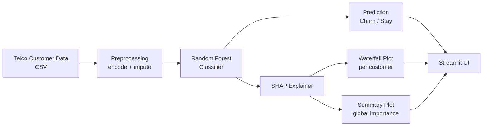
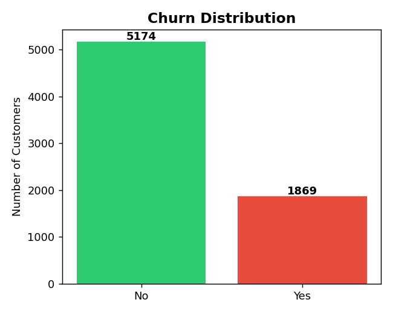
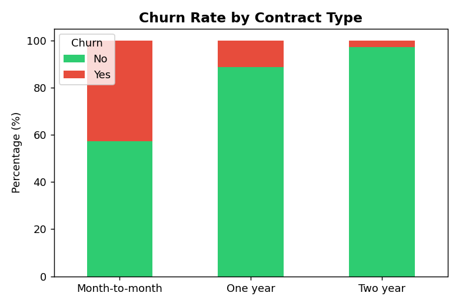
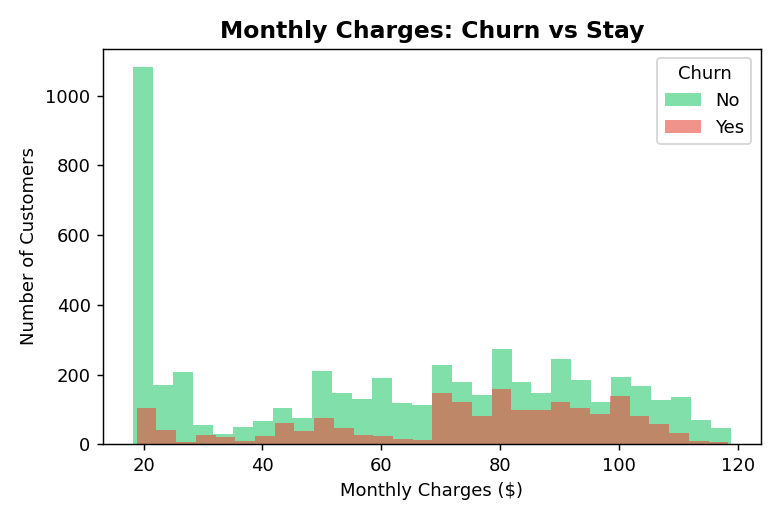
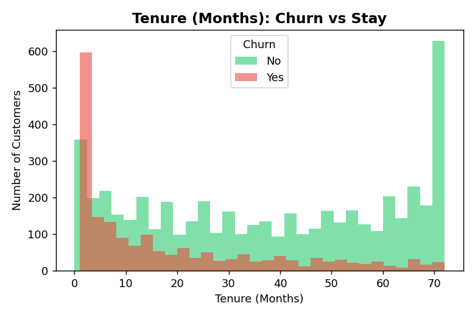
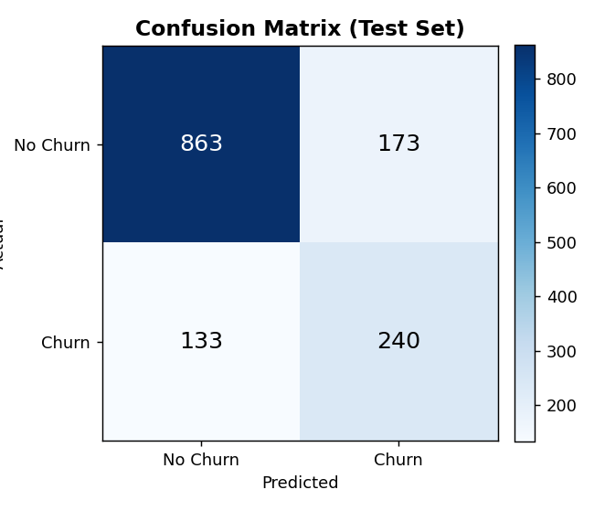
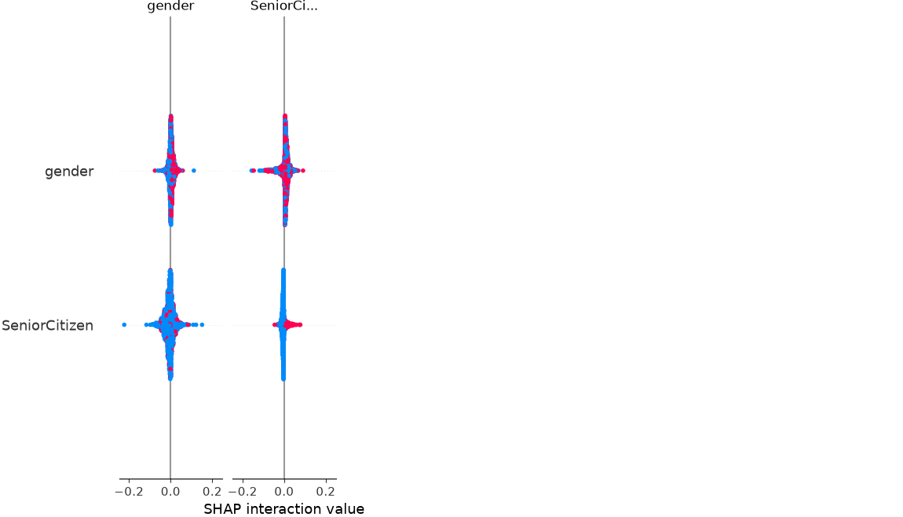

# 📊 Customer Churn Prediction with Explainable AI (XAI)


A Streamlit web app that predicts whether a telecom customer is likely to **churn**, and explains **why** using SHAP (SHapley Additive exPlanations) — not just a black-box prediction.

Built as part of a summer internship project on customer churn prediction.

---

## 🚀 Live Demo

> Add your deployed Streamlit Cloud link here once deployed, e.g.
> **[https://customer-churn-prediction.streamlit.app](https://streamlit.io/cloud)**

To deploy it yourself for free: push this repo to GitHub → go to [share.streamlit.io](https://share.streamlit.io) → connect the repo → set `app.py` as the entry point.

---

## 🧩 How It Works



---

## 📈 Exploratory Data Analysis

**Class balance** — churn is the minority class, which is why the model is trained with `class_weight="balanced"`:



**Contract type is one of the strongest churn signals** — month-to-month customers churn far more than customers on 1- or 2-year contracts:



**Customers who churn tend to pay more per month:**



**Customers who churn tend to be newer** — churn risk drops sharply as tenure increases:



---

## 🎯 Model Performance (Test Set)

Random Forest Classifier, 80/20 train-test split, `random_state=42`:

| Metric | Score |
|---|---|
| Accuracy | **78.3%** |
| Precision (weighted) | **79.1%** |
| Recall (weighted) | **78.3%** |
| F1-score (weighted) | **78.6%** |



---

## 🔍 Explainability with SHAP

Rather than a plain "churn / no churn" label, the app explains **which features drove each prediction**.

**Global feature importance** — across all customers, contract type, tenure, and internet service type are the biggest drivers of churn:



**Per-customer explanation** — for any single prediction, the app renders a live SHAP waterfall plot in the "Why this prediction?" panel, showing which features pushed that specific customer toward churn (red) or staying (blue).

---

## 🖥️ App Features

- Interactive form to enter a customer's personal info, subscribed services, and billing details
- Instant churn prediction with probability score and progress bar
- **"Why this prediction?"** — a SHAP waterfall plot for that individual customer
- **"Overall feature importance"** — the global SHAP summary plot from training
- **Model Performance** panel showing accuracy, precision, recall, F1, and confusion matrix on the test set

## 📁 Project Structure

```
.
├── app.py                    # Streamlit app (UI + prediction + SHAP explanations)
├── train_model.py            # Trains the Random Forest model and saves artifacts
├── model.pkl                 # Trained model (generated by train_model.py)
├── encoders.pkl              # LabelEncoders for categorical columns
├── shap_summary.png          # Global SHAP feature-importance plot
├── assets/                   # Charts used in this README
├── dataset/
│   └── WA_Fn-UseC_-Telco-Customer-Churn.csv
└── requirements.txt
```

## 🛠️ Getting Started

**1. Clone the repo**
```bash
git clone https://github.com/<your-username>/Customer-Churn-Prediction.git
cd Customer-Churn-Prediction
```

**2. Install dependencies**
```bash
pip install -r requirements.txt
```

**3. (Optional) Retrain the model** — pre-trained `model.pkl` and `encoders.pkl` are already included, so this is optional:
```bash
python train_model.py
```

**4. Run the app**
```bash
streamlit run app.py
```
The app opens at `http://localhost:8501`.

## 🧠 Model Details

- **Preprocessing**: categorical columns label-encoded; missing `TotalCharges` imputed with the median
- **Model**: `RandomForestClassifier(n_estimators=100, random_state=42, class_weight="balanced")`
- **Dataset**: [IBM Telco Customer Churn dataset](https://www.kaggle.com/datasets/blastchar/telco-customer-churn) — 7,043 customers, 21 features
- **Explainability**: `shap.TreeExplainer`

## 🧰 Tech Stack

Python · pandas · scikit-learn · SHAP · Streamlit · matplotlib

## 📄 License

This project is for academic/educational purposes.
